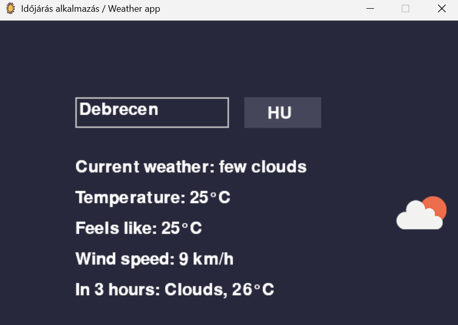
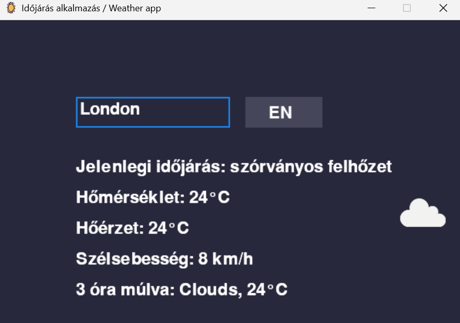

# Weather App with Pygame


A simple weather application built using Python's **Pygame** library and **OpenWeather API**. 
The app retrieves the **current weather** and a **3-hour weather forecast** based on the **city name** provided by the user
with corresponding weather icons.

---

## **Features**
- Displays the current weather conditions of a given city.
- Shows a 3-hour weather forecast for the selected city.
- Includes temperature, feels-like temperature, wind speed (in km/h), and rain amount (in mm).
- Uses OpenWeather API to fetch weather data.
- User interface built using Pygame.

## **Requirements**
Ensure you have the following installed before running the script:
- **Python 3.x**
- **Pygame**
- **Requests library**

## **Installation**
To install the required dependencies, run:
```bash
pip install pygame requests
```

## **Screenshots**



## **Example output**
Current weather: clear sky   
Temperature: 15°C    
Feels-like: 14°C  
Wind speed: 10 km/h  
In 3 hours: Cloudy, 13°C

## **Future Improvements**
- Improve the user interface with more details and interactive features.
- Integrate a map for selecting the location on a global scale.
- Convert datas into CSV.
- Add unit tests with mocking: Implement unit tests that mock external dependencies like API calls, 
HTTP requests, and weather data to ensure faster, isolated, and more reliable tests.

## **License and Data source**
This project uses weather data from the **OpenWeather API**. 
Data usage is governed by **OpenWeather’s Terms of Service and Privacy Policy**. 
The data is used under a free-tier plan for non-commercial, educational purposes.